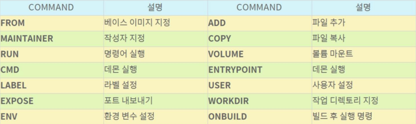
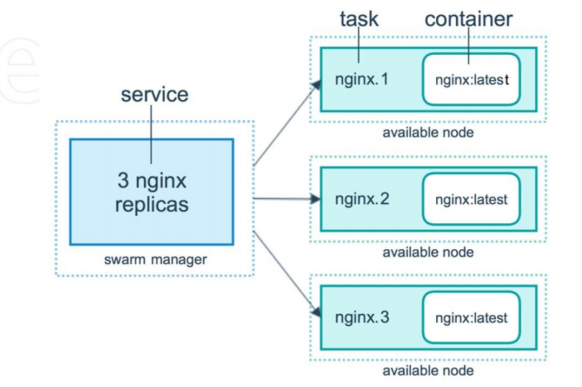

# Docker

## 개념

- 컨테이너형 가상화 기술 => 운영체제 수준 가상화
- 컨테이너란 호스트 OS상에 논리적인 구획을 만들고, 애플리케이션을 작동시키기 위해 필요한 라이브러리나 애플리케이션 을 하나로 모아, 별도의 서버인 것처럼 사용할 수 있게 만드는 것
- 가볍고 고속으로 작동
- 애플리케이션의 실행에 필요한 환경을 하나의 이미지로 모아두고 이미지를 사용하여 다양한 환경에서 애플리케이션 실행환경 구축 및 운용
- 3가지 기능
  - Docker 이미지 만듬 : docker image build
  - Docker 이미지 공유 : docker image push/pull
  - Docker 컨테이너 작동 : docker container run
- 구성 요소
  - Docker 이미지 : 파일 시스템과 실행할 애플리케이션 설정을 하나로 합친 것, 컨테이너를 생성하는 템플릿 역할
  - Docker 컨테이너 : 이미지 기반으로 생성, 파일 시스템과 애플리케이션 구체화 되어 실행

## Docker 가상머신

- VM Spec
  - OS : CentOS 7
  - CPU : 2Core
  - RAM : 4GB

## Docker(Docker CE; Community Edition) CentOS Install

```
# curl -fsSL https://get.docker.com/ | sh
# yum -y install bash-completion wget unzip net-tools mysql telnet rdate
# rdate -s time.bora.net && clock -w
# curl https://raw.githubusercontent.com/docker/docker-ce/master/components/cli/contrib/completion/bash/docker -o /etc/bash_completion.d/docker.sh
# systemctl start docker && systemctl enable docker
```

## Docker(Docker CE; Community Edition) Ubuntu Install

```
$ sudo apt update
$ sudo apt install apt-transport-https ca-certificates curl software-properties-common -y
$ curl -fsSL https://download.docker.com/linux/ubuntu/gpg | sudo apt-key add -
$ sudo add-apt-repository "deb [arch=amd64] https://download.docker.com/linux/ubuntu bionic stable"
$ sudo apt update
$ sudo apt-cache policy docker-ce
$ sudo apt install docker-ce -y
```

## Docker 기본 명령어

```
# docker search nginx
# docker image pull nginx
# docker image ls
# docker image inspect --format="{{ .Os}}" nginx # 상세 정보
# docker container create -p 80:80 --name webserver nginx
# docker container start webserver
# docker container stop webserver
# docker container start webserver
# docker container rm -f webserver
# docker container run -p 80:80 --name webserver nginx # foreground 실행
# docker container run -d -p 80:80 --name webserver nginx # background 실행
# docker container run --name test_cal centos /bin/cal
# docker container run --name test_cal --rm centos /bin/cal # 컨테이너 1회성 실행하고 종료/ 남김 없이 지워지는 것
# docker container run -it --name test_bash centos /bin/bash #it 컨테이너 내부로 들어가기 위한 명령어
# docker container run -d --name test_ping centos /bin/ping localhost
# docker container logs -t test_ping
# docker container run -d -p 8080:80 --name test_port nginx # 중요!!!
# docker container stats nginx
# docker container run -d -p 8181:80 --cpus 1 --memory=256m --name test_resource nginx
# docker container run -d -p 8282:80 --cpus 1 --memory=256m -v /tmp:/usr/share/nginx/html --name volume-container nginx
# docker container ls
# docker container ls -a
# docker container ls -a -f name=test_webserver
# docker container ls -a -f exited=0
# docker container ls -a --format "table {{.Names}}\t{{.Status}}"
# docker container attach test_bash
[root@1689b6318c35 /]# ctrl + p, ctrl +q 를 입력
# docker container ls
# docker container exec -it test_port /bin/echo "Hello world"
# docker container exec -it test_port /bin/bash
# docker container top test_port
# docker container port test_port
# docker container rename test_port webserver
# docker container cp webserver:/usr/share/nginx/html/index.html /root/index.html
# docker container cp ./index.html webserver:/usr/share/nginx/html/index.html
# docker container diff webserver
# docker container commit -a "johnlee<test@example.com>" -m "NICE TO MEET YOU" webserver test_commit:v1.0
# docker image ls
# docker image inspect test_commit:v1.0
# docker image save -o test_commit.tar test_commit:v1.0
# scp test_commit.tar root@192.168.0.207:/root
# docker image load -i test_commit.tar
# docker image ls
# docker images # ls와 같은 명령어
# docker container run -d -p 80:80 --name webserver test_commit:v1.0
# docker rm -f $(docker ps -a -q) # container 전부 다 한번에 지우기
# docker image rm nginx # image 지우기 / name, id 입력하여 지우기
# docker rmi centos:latest
# docker rmi $(docker images -q) # image 전부 다 한번에 지우기
# yum install -y iproute # ip a 사용을 위한 패키지 다운
# docker network ls
# docker network create -d bridge --subnet 192.168.123.0/24 --ip-range 192.168.123.128/25 test_bridge
# docker run -d -p 8383:80 --name webserver2 --network test_bridge nginx
# docker network connect test_bridge test_bash
# docker network disconnect bridge test_bash
```

## Wordpress

### dbserver

```
# docker run -d -p 3306:3306 --name dbserver \
-e MYSQL_DATABASE=wordpress \
-e MYSQL_USER=wpuser \
-e MYSQL_PASSWORD=wppass \
-e MYSQL_ROOT_PASSWORD=password --network test_bridge mariadb
```

### webserver

```
# docker run -it -d -p 8888:80 --name apache --network test_bridge centos:7
# docker exec -it apache bash
# yum install -y httpd php php-mysql php-gd php-mbstring wget unzip
# wget https://ko.wordpress.org/wordpress-4.8.2-ko_KR.zip
# cd /var/www/html
# unzip /wordpress-4.8.2-ko_KR.zip
# mv wordpress/* .
# chown -R apache:apache /var/www/*
# httpd &
```

## Docker hub

```
# docker login
# docker logout
```

## Docker File

### 개념

- 컨테이너를 생성하는 여러 구성 정보를 하나의 파일로 정리
- 일괄 실행하여 docker build 명령을 통해 Docker 이미지를 작성하는 스크립트
- Docker File 작성시 폴더 하나 만들어서 작성 / vi Dockerfile (D는 대문자)
- Docker file 명령어

  

- ADD 는 tar만 압축 해제 가능

### Docker File Create

- vm 에 apache 웹서버 깔아서 배포

```
# vi Dockerfile
FROM ubuntu:18.04
MAINTAINER seojun
LABEL "name"="webserver"
ENV aloha=date
ENV path=/var/www/html
RUN sed -i 's/archive.ubuntu.com/ftp.daumkakao.com/g' /etc/apt/sources.list
RUN apt-get update
RUN apt-get install apache2 -y
COPY nihao /var/www/html/nihao
COPY hello.html $path
ADD aws.tar /var/www/html
WORKDIR /var/www/html #cd, exec -it로 들어갔을 때 디렉토리 설정
RUN echo ohayo >> ohayo.html
VOLUME /var/www/html # -v /tmp:/var/www/html
EXPOSE 80 # container port -p 8888:80, -p 8080:80
ENTRYPOINT ["apachectl"] # ["apachectl", "-D","FOREGROUD"]
CMD ["-D", "FOREGROUND"] # apachectl -DFOREGROUD

# docker build -t jigreg/hello:v1.0 .
# docker images
# docker push jigreg/hello:v1.0
# docker run -itd -P --name hello jigreg/hello:v1.0
```

- 웹서버로만 배포

```
# mkdir test && cd $_
# tar cvf test.tar images index.html
# vi Dockerfile
FROM nginx:latest
ADD test.tar /usr/share/nginx/html
CMD ["nginx", "-g", "daemon off;"]
# docker build -t jigreg/homepage:v1.0 .
# docker run -itd -p:234:80 --name homepage jigreg/homepage:v1.0
```

- Wordpress 설치

```
# mkdir wordpress && cd $_
# vi Dockerfile
FROM centos:7
MAINTAINER seojun@example.com
RUN yum install -y httpd php php-mysql php-gd php-mbstring wget unzip
RUN wget https://ko.wordpress.org/wordpress-4.8.2-ko_KR.zip
WORKDIR /var/www/html
RUN unzip /wordpress-4.8.2-ko_KR.zip
RUN mv /wordpress/* .
RUN chown -R apache:apache /var/www/*
CMD httpd -DFOREGROUND
# docker build -t wordpress:v1.0 .
# docker push jigreg/wordpress:v1.0
# docker run -d -p 88:80 --name wordpress --network test_bridge wordpress:v1.0
```

- build -> push -> run 꼭 기억할 것!

## Docker Data

- Bind Mount

```
# mkdir volume && cd $_
# mkdir bm01 ; touch bm01/test.txt
# docker container run -itd --name bm-test -v ~/volume/bm01:/mnt centos:7
# docker container exec bm-test ls /mnt
```

- Volume

```
# docker volume create my-vol01
# docker volume list
# docker volume inspect my-vol01
"Mountpoint": "/var/lib/docker/volumes/my-vol01/_data"
# docker container run -itd --name vol-test -v my-vol01:/mnt centos:7
# docker container run -itd -p 81:80 --name vol-web -v my-vol01:/usr/local/apache2/htdocs:ro httpd:latest
# curl 192.168.0.88:801
<html><body><h1>It works!</h1></body></html>
# docker container exec vol-test sh -c "echo "Nihao" > /mnt/index.html"
# curl 192.168.0.88:801
Nihao
```

## Docker 네트워크 관리

```
# docker network list
# docker network inspect bridge
"com.docker.network.bridge.name": "docker0",
# docker network create new-net --subnet 172.31.0.0/16 --ip-range 172.31.0.0/20 --gateway 172.31.0.1
# docker network list
```

## onbuild 명령어 활용

### 운영자 역할

```
# mkdir onbuild && cd $_
# vi Dockerfile.base
FROM ubuntu:18.04
RUN sed -i 's/archive.ubuntu.com/ftp.daumkakao.com/g' /etc/apt/sources.list
RUN apt-get -y update
RUN apt-get -y install nginx
EXPOSE 80
ONBUILD ADD website*.tar /var/www/html/
CMD ["nginx", "-g", "daemon off;"]

# docker build -t jigreg/web-base:v1.0 -f Dockerfile.base .
# docker login
# docker push jigreg/web-base:v1.0
# vi Dockerfile
FROM jigreg/web-base:v1.0
```

### 개발자 역할

```
# mkdir onbuild && cd $_
# ls
website.tar
Dockerfile

# docker build -t jigreg/web-site:v1.0 .
# docker run -d -p 80:80 --name=website jigreg/web-site:v1.0
# docker login
# docker push jigreg/web-site:v1.0
```

### 운영자 역할(AWS)

```
# docker run -d -p 80:80 --name=test-site jigreg/web-site:v1.0
```

### AWS EC2에 Docker 설치

- sudo usermod -a -G docker ec2-user
- 앞에 sudo를 붙이지 않아도 docker 명령어 실행할 수 있도록 해줌
- docker라는 그룹에 ec2-user 추가

```
사용자 데이터
#!/bin/bash
sudo amazon-linux-extras install docker -y
sudo systemctl start docker && systemctl enable docker
curl https://raw.githubusercontent.com/docker/docker-ce/master/components/cli/contrib/completion/bash/docker -o /etc/bash_completion.d/docker.sh
sudo usermod -a -G docker ec2-user
docker run -itd -p 80:80 --name test-site jigreg/web-site:v2.0
docker run -d -p 5000:5000 --restart=always --name private-docker-registry registry
```

### Docker 사설 레지스트리

- restart always => 가상머신이 꺼졌다가 켜져도 항상 실행
- registry 포트는 5000:5000 으로 정해져 있음

```
# docker run -d -p 5000:5000 --restart=always --name private-docker-registry registry # 저장소 서버
# vi /etc/docker/daemon.json # 클라이언트
{ "insecure-registries":["docker.seojun.shop:5000"] }
# systemctl restart docker
# docker tag jigreg/hompage:v1.0 docker.seojun.shop:5000/homepage:v1.0
# docker push docker.seojun.shop:5000/homepage:v1.0
# docker run -dp 8888:80 --name private test docker.seojun.shop:5000/homepage:v1.0
```

## Docker Compose

### 개념

- Compose는 다중 컨테이너 Docker 애플리케이션을 정의하고 실행하기 위한 도구
- Yaml 파일을 사용하여 애플리케이션 서비스 구성
- 프로덕션, 스테이징, 개발, 테스트, CI 워크플로등 모든 환경에서 작동
- 3 단계 프로세스
  1. Dockerfile 어디서나 재현할 수 있도록 앱의 환경 정의
  2. 앱을 구성하는 서비스를 정의하기 위해 docker-compose.yml 형식의 스크립트로 격리된 환경에서 실행
  3. docker compose up 하면 Docker compose 명령이 전체 앱을 시작하고 실행, docker-compose updocker-compose 바이너리를 사용하여 실행

### Docker compose Install

```
# curl -L "https://github.com/docker/compose/releases/download/1.26.2/docker-compose-$(uname -s)-$(uname -m)" -o /usr/local/bin/docker-compose
# chmod +x /usr/local/bin/docker-compose
# mkdir my_wordpress && cd $_
# vi docker-compose.yml
version: "3.3"
services:
  dbserver:
    image: mysql:5.7
    volumes:
      - db_data:/var/lib/mysql
    restart: always
    environment:
      MYSQL_ROOT_PASSWORD: password
      MYSQL_DATABASE: wordpress
      MYSQL_USER: wpuser
      MYSQL_PASSWORD: wppass
  wordpress:
    depends_on:
      - dbserver
    image: wordpress:latest
    volumes:
      - wordpress_data:/var/www/html
    ports:
      - "80:80"
    restart: always
    environment:
      WORDPRESS_DB_HOST: dbserver:3306
      WORDPRESS_DB_USER: wpuser
      WORDPRESS_DB_PASSWORD: wppass
      WORDPRESS_DB_NAME: wordpress
volumes:
  db_data: {}
  wordpress_data: {}

# docker-compose up -d
# docker-compose ps
# docker-compose pause
# docker-compose unpause
# docker-compose port wordpress 80
# docker-compose config
# docker-compose stop wordpress
# docker-compose rm wordpress
# docker-compose down
# docker-compose down -v # volume 파일 삭제
# docker-compose down --rmi all

```

## Docker Container Monitoring - cAdvisor

```
VERSION=v0.44.0 # use the latest release version from https://github.com/google/cadvisor/releases
docker run \
  --volume=/:/rootfs:ro \
  --volume=/var/run:/var/run:ro \
  --volume=/sys:/sys:ro \
  --volume=/var/lib/docker/:/var/lib/docker:ro \
  --volume=/dev/disk/:/dev/disk:ro \
  --publish=8080:8080 \
  --detach=true \
  --name=cadvisor \
  --privileged \
  --device=/dev/kmsg \
  gcr.io/cadvisor/cadvisor:$VERSION
```

## Docker Swarm(스웜)

### 개념

- Docker 엔진 클러스터를 기본적으로 관리하기 위한 스웜 모드
- Docker CLI를 사용하여 스웜을 만들고, 스웜에 애플리케이션 서비스를 배포하고, 스웜 동작을 관리
- 기능
  - Docker 엔진과 통합된 클러스터 관리
  - 분산된 디자인
  - 원하는 상태 조정



### Docker swarm launch

```
# hostnamectl set-hostname master1

# cat <<EOF >> /etc/hosts
192.168.1.123 manager1
192.168.1.157 worker1
192.168.1.158 worker2
EOF

# docker swarm init --advertise-addr 192.168.1.123
# docker swarm join --token SWMTKN-1-13b5eb7x1uiqt1je8zynapwxjxagj05p84fi44cy9jvztqui8r-d2oxinkyz3aa73bepuwe2abp1 192.168.1.123:2377
# docker node ls
# docker service create --name my_web --replicas 3 --publish published=8080,target=80 nginx
# docker service ls
# docker service ps my_web
# docker service logs my_web
# docker service inspect --pretty my_web
# docker service scale my_web=5
# docker service ps my_web
# docker service rm my_web
```

### Docker rolling update

```
# docker service ps my_web
# docker service inspect --pretty my_web
# docker service update --image jigreg/web-site:v1.0 my_web
# docker service ps my_web
# docker service rollback my_web # 업데이트한 사이트 롤백시키기
```

### Docker Cluster Node Drain

```
# docker node ls
# docker service ps my_web
# docker node update --availability drain worker1
# docker node inspect --pretty worker1
# docker service ps my_web
# docker node update --availability active worker1
# docker node inspect --pretty worker1
# docker node ls
```
